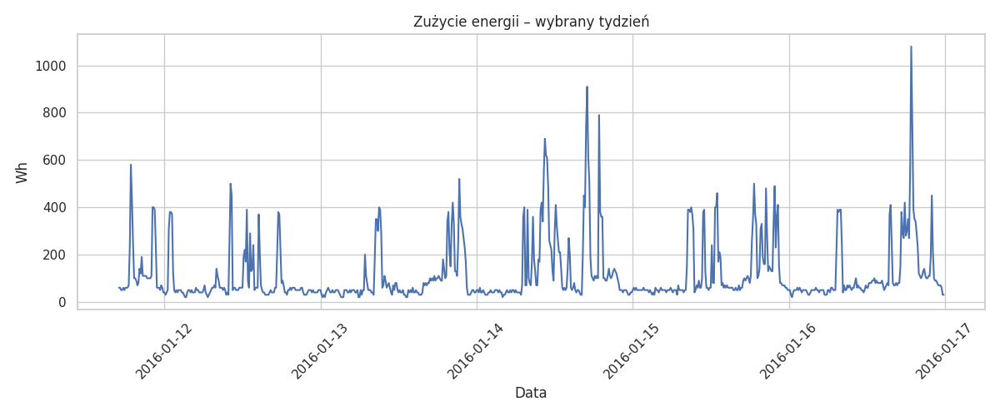
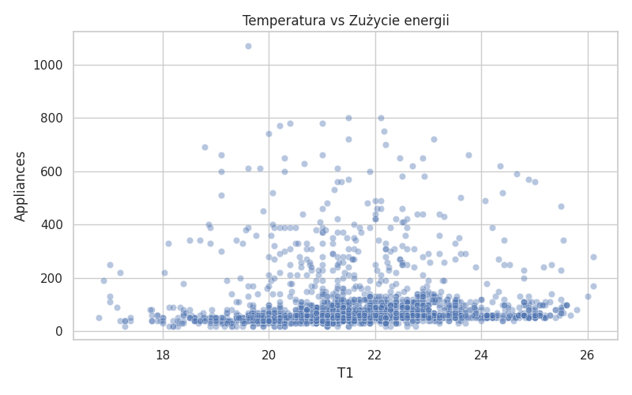
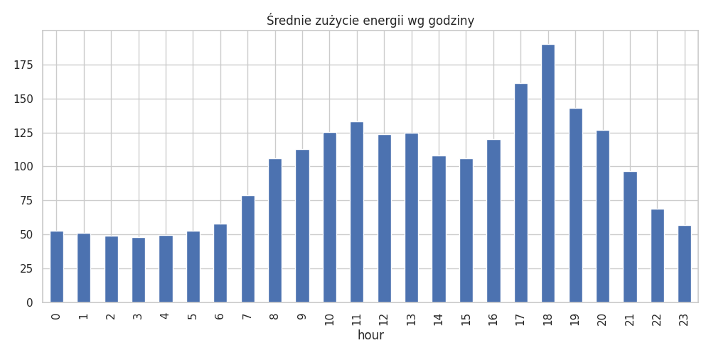

# Sprawozdanie – Analiza zużycia energii w systemie IoT

**Autor:** Julia Bąk 277647
**Kurs:** Inżynieria testów i jakości
**Data:** 24.04.2026

---

## Cel zadania

Celem zadania jest stworzenie wykresów opisujących działanie systemu IoT oraz analiza danych.

---

## Analiza danych

### Wykres 1: Średnie zużycie energii wg dnia tygodnia

### Wykres 2: Porównanie zużycia energii – czwartki vs weekend

### Wykres 3: Średnie zużycie energii w ciągu dnia (wg godzin)

---

## Wnioski

Średnie zużycie energii wg dnia tygodnia pokazuje, że w każdym dniu zużycie energii jest różne, natomiast wartości te oscylują w niewielkich przedziałach. Widoczne jest większe zużycie podczas weekendu.

Z drugiego wykresu można odczytać zwiększone zużycie energii w porze popołudniowej, utrzymujące się przez cały wieczór. W czwartek widoczny jest natomiast wyraźny wzrost zużycia energii w godzinach wieczornych.

Na trzecim wykresie widoczne są wyraźne skoki zużycia energii w godzinach porannych oraz wieczornych.
